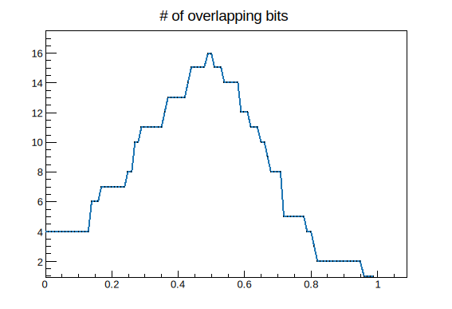

# HTM Algorithms

Hierarchical Temporal Memory is a biologically possible machine learning algorithm developed by [Numenta](https://numenta.com/). Biological possiblity means the algorithms has to simulate (or approximate) behaivour and limitations of real neurons. i.e. Neurons has to speak binary ([spikes](https://en.wikipedia.org/wiki/Biological_neuron_model)) and there's no global learning (no [backpropergation](https://en.wikipedia.org/wiki/Backpropagation)). In HTM Theory, this means HTM operates on [Sparse Distributed Representation](https://en.wikipedia.org/wiki/Sparse_distributed_memory) (SDR, basically binary tensors) and every layer operates indipendently.

This document will introduce HTM algorithms as a black box. It is highly reommended to watch the [HTM School](https://www.youtube.com/watch?v=XMB0ri4qgwc&list=PL3yXMgtrZmDqhsFQzwUC9V8MeeVOQ7eZ9) series on YouTube for deeper understanding of the material.

## Encoders

Encoders are how data interact with HTM. As mentioned earlier, HTM can only accepts binary as input and only generates binary output. So a method of converting data into SDRs is required. There are several encoders avaliable by default.

| Encoder    | Usage                           | 
|------------|---------------------------------| 
| scalar     | scalar of a defined range       | 
| category   | encodes category                | 
| gridCell1d | arbitrary scalar                | 
| gridCell2d | arbitrary 2D vector             | 

All encoders (for now) are plan function calls in the `et::encoder` namespace. And every of them returns a tensor of Booleans; you can inspect the result of any encoder by printing the returned value.

```C++
auto sdr = encoder::gridCell1d(0.5);
cout << sdr << endl;
```

Out

```
{ 0, 0, 0, 0, 0, 0, 0, 0, 1, 0, 0, 0, 0, 0, 0, 0, 0, 0, 0, 0, 0, 1, 0, 0, 0,
 0, 0, 0, 0, 0, 0, 0, 0, 0, 0, 0, 0, 0, 0, 0, 1, 0, 0, 0, 0, 0, 0, 0, 0, 0, 
 0, 0, 0, 0, 0, 0, 0, 0, 0, 0, 0, 0, 0, 1, 0, 1, 0, 0, 0, 0, 0, 0, 0, 0, 0, 
 0, 0, 0, 0, 0, 0, 0, 0, 0, 0, 0, 0, 0, 1, 0, 0, 0, 0, 0, 0, 0, 1, 0, 0, 0, 
 0, 0, 0, 0, 0, 0, 0, 0, 0, 0, 0, 0, 0, 0, 0, 1, 0, 0, 0, 0, 0, 0, 0, 0, 0, 
 0, 0, 0, 0, 0, 0, 0, 1, 0, 0, 0, 0, 0, 0, 0, 0, 0, 0, 0, 0, 0, 0, 0, 0, 0, 
 0, 0, 0, 0, 0, 0, 1, 0, 0, 0, 0, 0, 0, 0, 0, 0, 0, 0, 0, 0, 0, 0, 0, 0, 1, 
 0, 1, 0, 0, 0, 0, 0, 0, 0, 0, 0, 0, 0, 0, 0, 0, 0, 0, 0, 0, 0, 0, 0, 0, 0, 
 0, 0, 0, 1, 0, 0, 0, 0, 0, 0, 0, 0, 0, 0, 0, 0, 0, 1, 0, 0, 0, 0, 0, 0, 0, 
 0, 0, 0, 1, 0, 0, 0, 0, 0, 0, 0, 0, 0, 0, 0, 0, 0, 0, 0, 0, 0, 0, 1, 0, 0, 
 0, 0, 0, 0, 0, 0}
```

The rule of thumb for an encoders is that for any given pair of value encoded. The farther the values are, the less 1 bits in the resulting SDR overlaps. The short [ROOT](https://root.cern.ch) script demonstrates this property (for a [grid cell](https://en.wikipedia.org/wiki/Grid_cell) encoder).

```C++
root [] g = TGraph(100);
root [] x = encoder::gridCell1d(0.5);
root [] for(int i=0;i<100;i++) {
root []     float p = (float)i/100;
root []     auto s = encoder::gridCell1d(p);
root []     int overlap = sum(x && s).item<int>();
root []     g.SetPoint(i+1, p, overlap);
root [] }
root [] g.Draw();
root [] g.SetTitle("# of overlapping bits");
```

Out



### Extending encodings

Unless in a very simple case, you might have multiple fields or non-standard types in your data. In such case, you might need to come up with your own encoder or use multiple of them together. Having your own encoder is easy - the only requirment of an encoder is **a)** returns a fixed length binary tensor **b)** the tensor have to be sparse and **c)** values futher apart should have less and less 1 bits overlapping. **a and b** are requirments. Failing to fulill will lead to a program crash. While **c** is nice to have but not having it will only causing bad learning results or not learning at all.

For example. We can come up with an basic scalar encoder that encodes values from 0~1.

```C++
Tensor dumb_encoder(float v)
{
    intmax_t start = v*(64-4);
    // Create a tensor of length 64.
    // Then set 4 of the bits to 1
    Tensor sdr = zeros({64}, DType::Bool);
    sdr[{range(start, start+4)}] = 1;
    return sdr;
}

cout << dumb_encoder(0.1) << endl;
```

Out

```
{ 0, 0, 0, 0, 0, 0, 1, 1, 1, 1, 0, 0, 0, 0, 0, 0, 0, 0, 0, 0, 0, 0, 0, 0, 0,
 0, 0, 0, 0, 0, 0, 0, 0, 0, 0, 0, 0, 0, 0, 0, 0, 0, 0, 0, 0, 0, 0, 0, 0, 0, 
 0, 0, 0, 0, 0, 0, 0, 0, 0, 0, 0, 0, 0, 0}
```

It is quite hard to build a robust encoder for complex data and in most cases the data are not related to each other. So pratically we would apply encoding to each field then concatenate all SDRs together.

```C++
Tensor complex_encoder(float v1, float v2, float v3) {
        Tensor sdr1 = encoder::scalar(v1);
        Tensor sdr2 = encoder::scalar(v2);
        Tensor sdr3 = encoder::scalar(v3);
        return concat({sdr1, sdr2, sdr3});
}

cout << complex_encoder(0.1, 0.2, 0.3) << endl;
```

Out

```
{ 0, 0, 1, 1, 1, 1, 0, 0, 0, 0, 0, 0, 0, 0, 0, 0, 0, 0, 0, 0, 0, 0, 0, 0, 0,
 0, 0, 0, 0, 0, 0, 0, 0, 0, 0, 0, 0, 1, 1, 1, 1, 0, 0, 0, 0, 0, 0, 0, 0, 0, 
 0, 0, 0, 0, 0, 0, 0, 0, 0, 0, 0, 0, 0, 0, 0, 0, 0, 0, 0, 0, 0, 0, 1, 1, 1, 
 1, 0, 0, 0, 0, 0, 0, 0, 0, 0, 0, 0, 0, 0, 0, 0, 0, 0, 0, 0, 0}
```